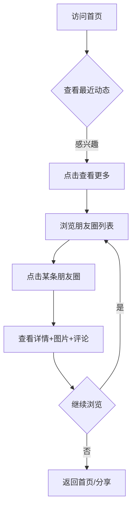
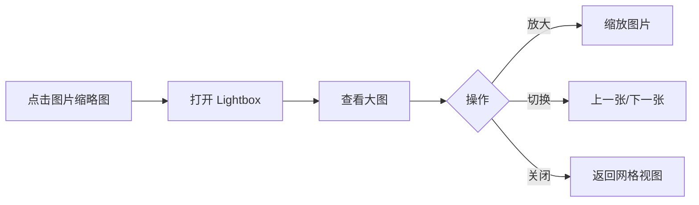

# 朋友圈网页平台 PRD

## 1. 产品概述

一个现代简约的个人"朋友圈"展示平台，用于发布和展示个人的日常动态、生活片段和创意内容。平台采用大胆的视觉设计，通过独特的布局和流畅的交互动效，为访客带来沉浸式的浏览体验。

**核心价值：**
- 打造个人品牌的视觉名片
- 以艺术画廊的形式展示生活瞬间
- 支持社交互动（评论系统）
- 便于部署和维护（GitHub Pages）

## 2. 核心功能

### 2.1 用户角色

| 角色 | 权限 | 说明 |
|------|------|------|
| 访客 | 浏览、评论 | 可查看所有朋友圈内容并参与评论 |
| 管理员（你） | 发布、管理 | 通过修改源码管理内容 |

### 2.2 功能模块

1. **首页（Home）**
   - 个人介绍模块
   - 最近3条朋友圈动态预览
   - "查看更多"入口按钮
   - 页脚（联系方式、版权信息）

2. **朋友圈列表页（Moments）**
   - 完整的朋友圈时间线展示
   - 瀑布流/网格布局
   - 点击进入详情页

3. **朋友圈详情页（Detail）**
   - 头像、昵称、时间戳
   - 文字内容
   - 3x3 图片网格展示
   - 图片放大查看功能（Lightbox）
   - Giscus 评论系统

4. **图片查看器**
   - 全屏图片展示
   - 缩放、拖拽功能
   - 键盘导航（ESC 关闭，方向键切换）
   - 触摸手势支持（移动端）

## 3. 核心流程

### 3.1 用户浏览流程



### 3.2 图片查看流程



## 4. 用户界面设计

### 4.1 设计风格

**主题：极简主义 × 大胆留白 × 玻璃拟态**

- **主色调：** 深邃黑 `#0a0a0a`（背景）+ 纯白 `#ffffff`（文字）
- **强调色：** 渐变橙 `#ff6b35` → `#f7931e`（CTA 按钮、交互元素）
- **辅助色：** 柔和灰 `#1a1a1a`（卡片背景）、`#333333`（次级元素）
- **玻璃效果：** `backdrop-filter: blur(20px)` + 半透明背景

**字体选择：**
- 标题：**Noto Serif SC**（衬线体，优雅大气）
- 正文：**Noto Sans SC**（无衬线，清晰易读）
- 特殊强调：Cinzel（英文装饰字体）

**布局风格：**
- 大胆的非对称网格布局
- 大量留白创造呼吸感
- 元素悬浮效果（卡片微微上浮）
- 滚动触发的渐入动画（Staggered Reveal）

**按钮样式：**
- 圆角胶囊按钮
- 渐变背景 + 悬停发光效果
- 立体阴影层次感

**图标风格：**
- 使用 Lucide Icons（线性风格）
- 统一的描边宽度（2px）

### 4.2 页面设计详情

#### 首页（Home）

| 模块 | 布局 | 视觉元素 | 动效 |
|------|------|---------|------|
| Hero 区域 | 全屏高度，居中 | 大标题 + 副标题 + 头像 | 淡入上移，1.2s ease-out |
| 个人介绍 | 左侧文字，右侧装饰 | 名言/简介 | 打字机效果（可选） |
| 最近动态 | 3列网格卡片 | 缩略图 + 摘要 | 悬停放大1.05 |
| CTA 按钮 | 居中悬浮 | "查看更多朋友圈" | 脉冲光晕动画 |
| 页脚 | 底部固定 | 社交图标 + 版权 | 淡入 |

#### 朋友圈列表页（Moments）

| 模块 | 布局 | 视觉元素 | 动效 |
|------|------|---------|------|
| 页面标题 | 顶部居中 | "Moments" 大字 | 淡入 |
| 时间线 | 垂直滚动布局 | 日期分隔线 | 滚动触发渐入 |
| 动态卡片 | 左图右文/上图下文 | 缩略图网格 | 悬停微浮起 |

#### 朋友圈详情页（Detail）

| 模块 | 布局 | 视觉元素 | 动效 |
|------|------|---------|------|
| 头部信息 | 固定顶部 | 头像 + 昵称 + 时间 | 下滑隐藏 |
| 正文内容 | 全宽容器 | 富文本渲染 | 淡入 |
| 图片网格 | 3x3 响应式网格 | 缩略图 | 点击打开 Lightbox |
| Lightbox | 全屏遮罩 | 大图 + 导航 | 缩放淡入 |
| 评论区域 | 底部固定 | Giscus 组件 | 懒加载 |

### 4.3 响应式策略

**桌面优先，移动适配：**

- **桌面（>1024px）：** 3列网格，完整布局
- **平板（768-1024px）：** 2列网格，调整间距
- **手机（<768px）：** 单列堆叠，触摸优化，全屏 Lightbox

## 5. 技术选型

### 5.1 技术栈

- **构建工具：** Vite
- **前端框架：** React 18
- **路由：** React Router v6
- **样式：** Tailwind CSS 3 + 自定义 CSS 变量
- **动画：** Framer Motion（页面过渡）+ CSS 动画（微交互）
- **图片查看：** react-photo-view（Lightbox 组件）
- **评论系统：** Giscus（GitHub Discussions 驱动）
- **图标：** Lucide React
- **字体：** Google Fonts（Noto Sans/Serif SC）

### 5.2 项目结构

```
my-moments/
├── public/
│   └── images/          # 朋友圈图片资源
├── src/
│   ├── assets/          # 静态资源
│   ├── components/      # 通用组件
│   │   ├── Header.jsx
│   │   ├── Footer.jsx
│   │   ├── MomentCard.jsx
│   │   ├── ImageGrid.jsx
│   │   └── Lightbox.jsx
│   ├── pages/
│   │   ├── Home.jsx
│   │   ├── Moments.jsx
│   │   └── MomentDetail.jsx
│   ├── data/
│   │   └── moments.js   # 朋友圈数据
│   ├── styles/
│   │   └── index.css    # 全局样式
│   ├── App.jsx
│   └── main.jsx
├── index.html
├── package.json
├── vite.config.js
└── tailwind.config.js
```

## 6. 数据模型

### 6.1 朋友圈数据

```javascript
{
  id: "moment-001",
  author: {
    name: "你的昵称",
    avatar: "/images/avatar.jpg"
  },
  content: "今天的美好瞬间...",
  images: ["/images/1.jpg", "/images/2.jpg", ...],
  createdAt: "2024-01-15T10:30:00Z",
  tags: ["生活", "旅行"]
}
```

### 6.2 Giscus 配置

- 使用 GitHub Discussions 作为评论后端
- 每个朋友圈详情页对应一个独立的 Discussion 话题
- 通过 URL 参数（如 `?discussion=1`）关联

## 7. 部署方案

### 7.1 GitHub Pages 部署流程

1. 在 GitHub 创建仓库 `my-moments`
2. 本地开发测试
3. 构建生产版本：`npm run build`
4. 部署到 GitHub Pages：
   - 使用 `gh-pages` 包自动部署
   - 或 GitHub Actions 自动化流程

### 7.2 域名配置（可选）

- 可绑定自定义域名
- 在 `vite.config.js` 配置 base 路径

## 8. 内容管理

由于采用静态网站架构，内容管理通过修改源码实现：

1. **新增朋友圈：** 在 `src/data/moments.js` 添加数据对象
2. **上传图片：** 将图片放入 `public/images/` 目录
3. **更新介绍：** 修改 `Home.jsx` 中的个人简介

**工作流程：**
```bash
# 编辑数据
vim src/data/moments.js

# 本地预览
npm run dev

# 提交代码
git add . && git commit -m "Add new moment"

# 自动部署
git push origin main
```
