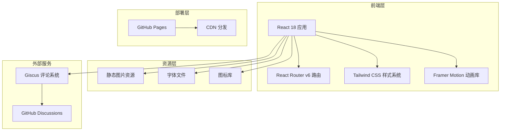
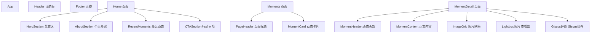

# 朋友圈网页平台 - 技术架构文档

## 1. 架构设计

### 1.1 系统架构图



### 1.2 技术架构层次

| 层次 | 技术选型 | 职责 |
|------|---------|------|
| **视图层** | React 18 + JSX | 组件化 UI 渲染 |
| **路由层** | React Router v6 | SPA 路由管理 |
| **样式层** | Tailwind CSS 3 | 原子化 CSS 样式 |
| **动画层** | Framer Motion | 页面过渡、交互动效 |
| **图片层** | react-photo-view | Lightbox 图片查看 |
| **评论层** | Giscus | GitHub 驱动的评论系统 |
| **部署层** | GitHub Pages | 静态网站托管 |

## 2. 技术选型详解

### 2.1 核心依赖

```json
{
  "dependencies": {
    "react": "^18.2.0",
    "react-dom": "^18.2.0",
    "react-router-dom": "^6.20.0",
    "framer-motion": "^10.16.0",
    "react-photo-view": "^1.2.4",
    "lucide-react": "^0.294.0",
    "gh-pages": "^6.1.0"
  },
  "devDependencies": {
    "@vitejs/plugin-react": "^4.2.0",
    "autoprefixer": "^10.4.16",
    "postcss": "^8.4.32",
    "tailwindcss": "^3.3.6",
    "vite": "^5.0.0"
  }
}
```

### 2.2 工具链

- **包管理：** npm
- **构建工具：** Vite 5.0
- **开发服务器：** Vite Dev Server（热重载）
- **CSS 预处理器：** PostCSS + Tailwind CSS
- **代码规范：** ESLint + Prettier

## 3. 路由定义

| 路由 | 页面组件 | 路径参数 | 说明 |
|------|---------|---------|------|
| `/` | Home | - | 首页，展示个人介绍和最近动态 |
| `/moments` | Moments | - | 朋友圈列表页 |
| `/moment/:id` | MomentDetail | `id` - 朋友圈唯一标识 | 朋友圈详情页 |
| `*` | NotFound | - | 404 页面 |

### 3.1 路由配置

```jsx
// src/App.jsx
import { BrowserRouter, Routes, Route } from 'react-router-dom';
import Home from './pages/Home';
import Moments from './pages/Moments';
import MomentDetail from './pages/MomentDetail';
import NotFound from './pages/NotFound';

function App() {
  return (
    <BrowserRouter>
      <Routes>
        <Route path="/" element={<Home />} />
        <Route path="/moments" element={<Moments />} />
        <Route path="/moment/:id" element={<MomentDetail />} />
        <Route path="*" element={<NotFound />} />
      </Routes>
    </BrowserRouter>
  );
}
```

## 4. 组件架构

### 4.1 组件树



### 4.2 核心组件说明

#### 4.2.1 Header 导航头

- **功能：** 页面顶部导航，包含 Logo 和菜单链接
- **状态：** 滚动时背景模糊、缩小高度
- **样式：** 玻璃拟态效果

#### 4.2.2 HeroSection 英雄区

- **功能：** 全屏欢迎区域，展示头像和标语
- **动画：** 页面加载时淡入上移
- **布局：** 垂直居中，大字号标题

#### 4.2.3 RecentMoments 最近动态

- **功能：** 展示最近的 3 条朋友圈
- **布局：** 3 列网格卡片
- **交互：** 悬停放大，点击跳转详情

#### 4.2.4 ImageGrid 图片网格

- **功能：** 3x3 网格展示朋友圈图片
- **响应式：** 
  - 桌面：3 列
  - 平板：2 列
  - 手机：1 列
- **交互：** 点击打开 Lightbox

#### 4.2.5 Lightbox 图片查看器

- **功能：** 全屏查看大图
- **操作：** 
  - 缩放（滚轮/双指）
  - 拖拽移动
  - 左右箭头切换
  - ESC 关闭
- **动画：** 缩放淡入效果

#### 4.2.6 Giscus 评论组件

- **功能：** 嵌入 Giscus 评论系统
- **配置：** 
  - 映射到 GitHub Discussions
  - 每个详情页对应独立 discussion
- **懒加载：** Intersection Observer 触发加载

## 5. 数据流设计

### 5.1 数据来源

```javascript
// src/data/moments.js
export const moments = [
  {
    id: 'moment-001',
    author: {
      name: '你的昵称',
      avatar: '/images/avatar.jpg'
    },
    content: '今天天气真好！',
    images: [
      '/images/moment-001-1.jpg',
      '/images/moment-001-2.jpg',
      '/images/moment-001-3.jpg'
    ],
    createdAt: '2024-01-15T10:30:00Z',
    tags: ['日常']
  },
  // ... 更多朋友圈
];

export const recentMoments = moments.slice(0, 3);
```

### 5.2 状态管理

由于是静态网站，采用 **Props Drilling** 方式传递数据：

```
App
  └── Routes
        ├── Home (接收 recentMoments)
        │     └── RecentMoments
        ├── Moments (接收 allMoments)
        │     └── MomentCard[]
        └── MomentDetail (根据 id 查找)
              └── ImageGrid
```

## 6. Giscus 集成方案

### 6.1 Giscus 配置

```javascript
// src/components/GiscusComments.jsx
import Giscus from '@giscus/react';

function GiscusComments({ discussionId }) {
  return (
    <Giscus
      id="comments"
      repo="username/my-moments"
      repoId="R_xxx"
      category="Announcements"
      categoryId="DIC_xxx"
      mapping="specific"
      term={discussionId}
      reactionsEnabled="1"
      emitMetadata="0"
      inputPosition="top"
      theme="dark"
      lang="zh-CN"
    />
  );
}
```

### 6.2 Discussion 映射

每个朋友圈详情页通过 URL 中的 `id` 作为 discussion 的 `term`：

```javascript
// MomentDetail.jsx
const discussionId = `moment-${moment.id}`;
<GiscusComments discussionId={discussionId} />
```

## 7. 样式系统设计

### 7.1 Tailwind CSS 配置

```javascript
// tailwind.config.js
module.exports = {
  content: [
    "./index.html",
    "./src/**/*.{js,jsx}",
  ],
  theme: {
    extend: {
      colors: {
        primary: '#0a0a0a',
        secondary: '#1a1a1a',
        accent: {
          DEFAULT: '#ff6b35',
          hover: '#f7931e',
        },
        surface: '#ffffff',
      },
      fontFamily: {
        serif: ['Noto Serif SC', 'serif'],
        sans: ['Noto Sans SC', 'sans-serif'],
        display: ['Cinzel', 'serif'],
      },
      animation: {
        'fade-in-up': 'fadeInUp 1.2s ease-out',
        'pulse-glow': 'pulseGlow 2s ease-in-out infinite',
      },
    },
  },
  plugins: [],
}
```

### 7.2 全局 CSS 变量

```css
/* src/styles/index.css */
:root {
  --color-primary: #0a0a0a;
  --color-secondary: #1a1a1a;
  --color-accent: #ff6b35;
  --color-accent-hover: #f7931e;
  --color-surface: #ffffff;
  
  --font-serif: 'Noto Serif SC', serif;
  --font-sans: 'Noto Sans SC', sans-serif;
  --font-display: 'Cinzel', serif;
  
  --shadow-card: 0 10px 40px rgba(0, 0, 0, 0.3);
  --shadow-glow: 0 0 30px rgba(255, 107, 53, 0.5);
  
  --blur-glass: blur(20px);
}

* {
  margin: 0;
  padding: 0;
  box-sizing: border-box;
}

body {
  background-color: var(--color-primary);
  color: var(--color-surface);
  font-family: var(--font-sans);
  line-height: 1.6;
}
```

## 8. 部署架构

### 8.1 GitHub Pages 部署流程


### 8.2 Vite 配置

```javascript
// vite.config.js
import { defineConfig } from 'vite';
import react from '@vitejs/plugin-react';

export default defineConfig({
  plugins: [react()],
  base: './', // 相对路径，支持 GitHub Pages
  build: {
    outDir: 'dist',
    assetsDir: 'assets',
  },
});
```

### 8.3 GitHub Actions 工作流

```yaml
# .github/workflows/deploy.yml
name: Deploy to GitHub Pages

on:
  push:
    branches: [main]

jobs:
  deploy:
    runs-on: ubuntu-latest
    steps:
      - uses: actions/checkout@v3
      
      - name: Setup Node.js
        uses: actions/setup-node@v3
        with:
          node-version: '18'
          
      - name: Install dependencies
        run: npm ci
        
      - name: Build
        run: npm run build
        
      - name: Deploy
        uses: peaceiris/actions-gh-pages@v3
        with:
          github_token: ${{ secrets.GITHUB_TOKEN }}
          publish_dir: ./dist
```

## 9. 性能优化策略

### 9.1 图片优化

- **懒加载：** 使用 `loading="lazy"` 属性
- **响应式图片：** `<picture>` 标签适配不同屏幕
- **格式选择：** WebP 优先，PNG/JPG 降级

### 9.2 代码分割

- **路由级分割：** React.lazy + Suspense
- **组件懒加载：** 按需加载 Heavy 组件

```javascript
const MomentDetail = lazy(() => import('./pages/MomentDetail'));
```

### 9.3 缓存策略

- **静态资源：** 长期缓存（1 年）
- **HTML：** 不缓存或短期缓存
- **CDN：** 启用 gzip/brotli 压缩

## 10. 项目初始化清单

- [ ] 初始化 Vite + React 项目
- [ ] 安装依赖（Tailwind、Framer Motion 等）
- [ ] 配置 Tailwind CSS
- [ ] 配置路由系统
- [ ] 创建全局样式
- [ ] 开发通用组件（Header、Footer）
- [ ] 开发首页（Home）
- [ ] 开发朋友圈列表页（Moments）
- [ ] 开发朋友圈详情页（MomentDetail）
- [ ] 集成 Giscus 评论
- [ ] 配置 GitHub Actions 部署
- [ ] 测试响应式布局
- [ ] 性能优化和 SEO 优化
